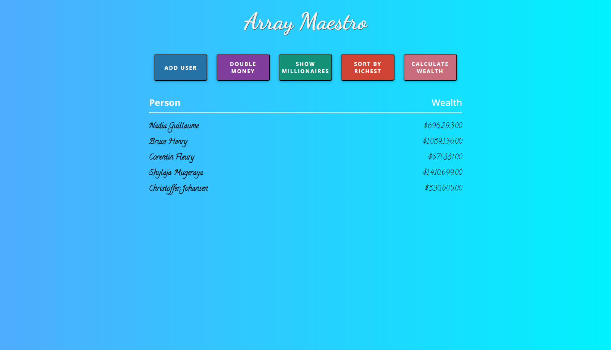
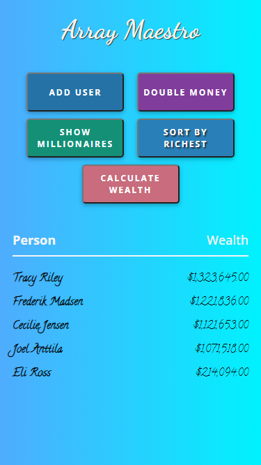
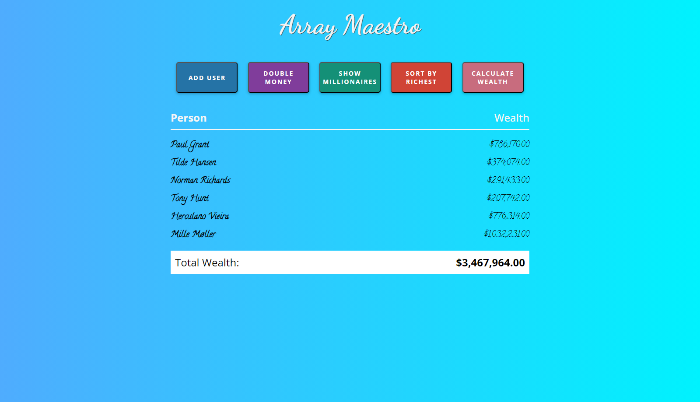

This JavaScript project utilizes common array methods to manage user data obtained from the RandomUser API. The primary functionalities include adding random users to the lists with their name and money, doubling the money function where using the _map_ method, sorting users by richest using the _sort_ method, filtering users based on a determined value with the _filter_ method, and calculating the total wealth with the _reduce_ method. The project is implemented using HTML, CSS, and JavaScript.

## Features

1. **Add Random Users:** Users can add random users to the lists along with their name and money.

2. **Double Money:** The map method is used in double the money function of each user.

3. **Sort Users by Richest:** The sort method is implemented to list users by their wealth in descending order.

4. **Filter Users:** The filter method allows users to filter the list based on a determined value.

5. **Calculate Total Wealth:** The reduce method is employed to calculate the total wealth of all users.

