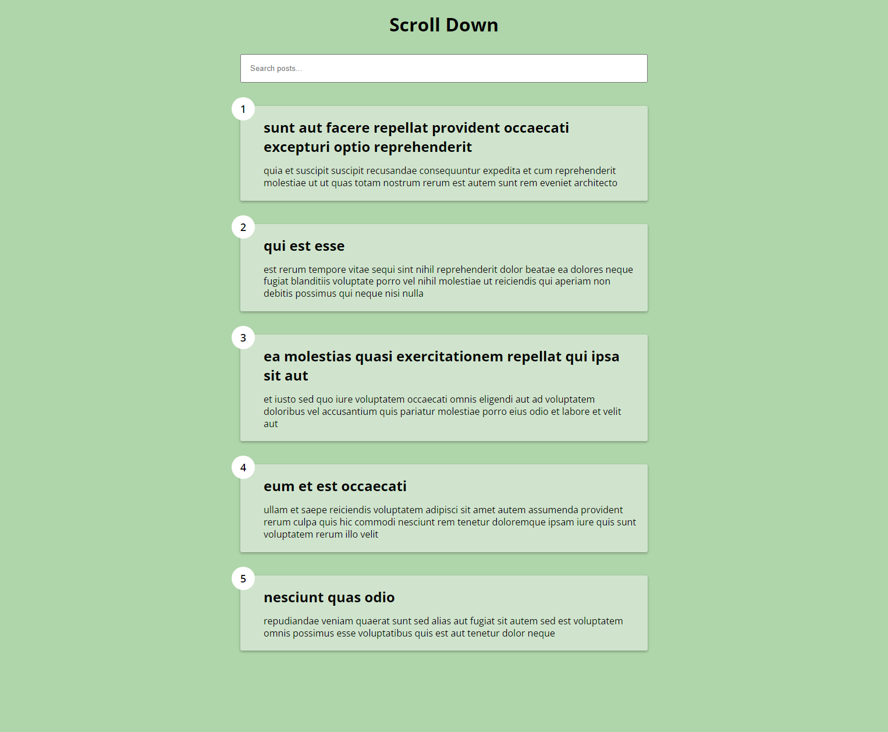
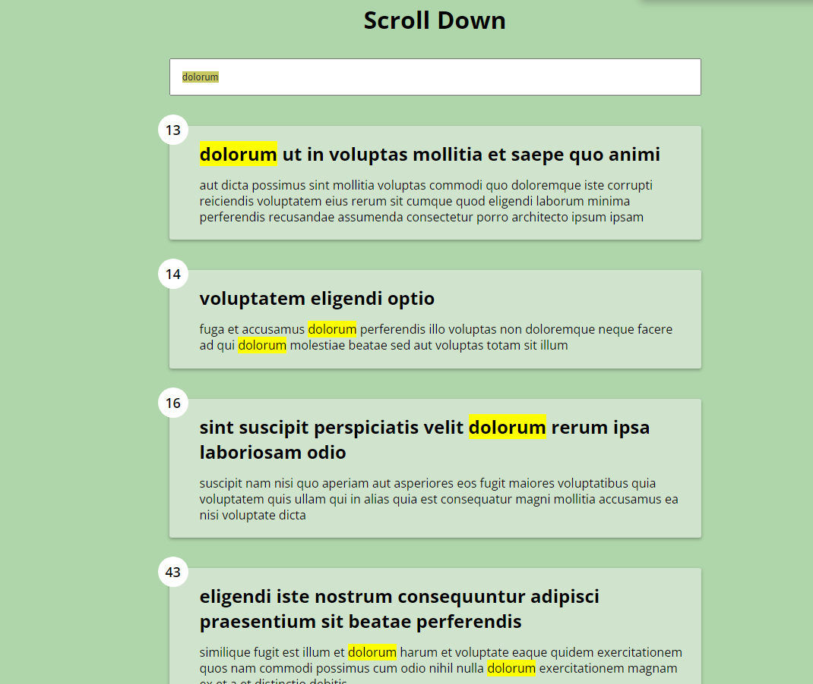

This project demonstrates the implementation of infinite scroll in a JavaScript application. It fetches data from a fake API and displays posts with a limit of 5 initially. As the user scrolls down, additional posts are loaded dynamically in batches of 5. The project also includes a feature to filter posts by post title or feed, with case-insensitive matching.

## Features

1. **Infinite Scroll:** Dynamically load more posts as the user scrolls down the page.

2. **Fake API Integration:** Fetch data from a fake API to simulate real-world data retrieval.

    

3. **Loading Animation:** Show loading animations while new posts are being fetched.

4. **Filtering:** Allow users to filter posts by post title or feed with case insensitive experience.

    

